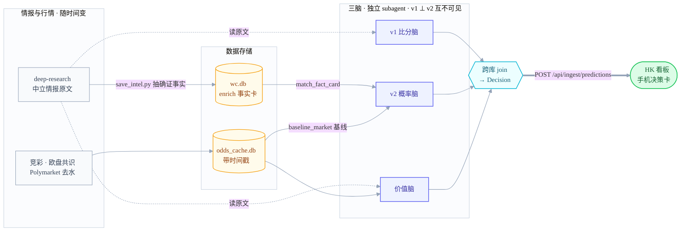

# fifa-world-cup-2026 — WC 预测 × 价值看板

世界杯 2026 的**每日预测 + 下注价值看板**。三套相互独立的预测脑 + 一键编排，把
"今天哪几场、比分大概多少、胜平负概率多少、盘口有没有价值、哪条腿最不亏"
做成手机可扫读的**决策卡**，部署在 AWS-HK 实时访问。

> 📐 **架构总览** → [`docs/架构.md`](docs/架构.md)：四角色（情报粮草 + v1/v2/价值三脑）· 逻辑数据流 + 运行拓扑图 · 核心红线（v1⊥v2）· 置信度模型。

## 诚实定位

- **不是**稳定盈利/回血机器——足彩长期 -EV，没有工具能改变这一点。
- **不**自动下注、**不**碰资金、**不**构成投资建议。
- 价值 = 把"几乎必亏"改善为"大致打平、偶尔薄赚 + 守住下限 + 不上头"，用数据保持清醒。

## 架构

四个角色:**deepsearch 情报层** = 粮草(只供料、不下结论);**v1 比分 / v2 概率 / 价值** = 三个互相隔离的脑。同一份料喂三脑、各产一份结论 → join 成**决策卡** → 推手机看板。三脑独立,所以"撞车=可信、分歧=警报"。



- 🔴 **红线**:v1 与 v2 预测时互不可见，否则三方 Brier 跑分(v1/v2/市场基线)失真
- ⏱ **新鲜度**:盘口取最新水位、intel 超 48h 不驱动偏离、WebFetch 同 URL 缓存 15min;陈旧 Poly 会伪造"假黄档"
- 🌐 **拓扑**:LLM 只能本地 Mac 跑(订阅制无 API key);Polymarket 经 HK remote-agent 抓回;足彩走住宅代理过 WAF

> 三脑职责详见下表;完整数据流 + 运行拓扑 + 置信度模型 → [`docs/架构.md`](docs/架构.md)

## 三套预测脑（互不污染）

| 脑 | Agent | 产出 | 不做 |
|---|---|---|---|
| **v1 比分** | `football-match-predictor` | 出线形势 + 比分(主-客) + 自评胜平负% | 不算价值/EV |
| **v2 概率** | `wc-forecaster-v2` | 市场锚定胜平负概率 + 靠谱度(稳/中/乱) + 剧本标签 | 不出精确比分、不算 EV、不推下注 |
| **价值** | `odds-value-analyst` | 竞彩×Poly去水 价值(🟢/🟡/🔴) + 最不亏的腿 + 结算机制 | 不预测比分/出线 |

### 🔴 v1 ⊥ v2 红线（不可妥协）

v2 在**预测时刻**只能看到：市场基线 `baseline_market()` + 中立事实卡 `match_fact_card()`
（停赛/伤停/官宣轮换）。**绝不**喂任何 v1 的比分/概率/推理。
这条隔离是三方 Brier 跑分（v1 vs v2 vs 市场基线）有效性的前提——v2 一旦看到 v1，
两者相关、跑分失真。实现上是两次**独立 subagent 调用**、上下文互不可见。

## 一键编排：`跑今天`

`.claude/skills/跑今天/SKILL.md` —— 说「跑今天」即按 7 步走完每日 routine（~80% 自动化）：

1. **按 ET 当下时刻**判定该预测哪几场（CST = ET+12/13；温哥华 PT = ET−3）
2. **刷三源盘口**：竞彩(本地直连) · 欧盘共识(500.com 去水) · Polymarket(HK 远程抓回)
3. **并行派三条独立 pass**（死守 v1⊥v2 红线）→ 各自写回缓存 + reports
4. 跑 **Brier 跑分卡**：`python3 tools/v2_report.py` → `reports/预测v2.md`
5. **跨库 join 成决策对象** → POST `/api/ingest/predictions` 写回 HK 看板
6. 一段话给用户**扫读总结**
7. **诚实边界**：赛前~1h 首发微调窗仍需手动再触发一次（临场首发 + 末段盘口移动）

## 决策卡 / 看板

后端 FastAPI（`backend/web.py`），前端原生 JS（决策 / 看板 / 报告 三页）。
核心契约对象 **Decision**（详见 `docs/superpowers/specs/2026-06-25-one-action-and-dashboard-redesign-CONTRACT.md`）：

```jsonc
{
  "match_key": "韩国 vs 南非",
  "ko_bj": "6.27 02:00", "ko_et": "ET 6.26 14:00", "status": "Selling",
  "v1":    { "score": "0-1", "rationale": "韩平即出线", "probs": {"h":30,"d":30,"a":40} },
  "v2":    { "probs": {"h":38,"d":30,"a":32}, "reliability": "乱",
             "scenarios": ["默契平"], "deviated": true },
  "value": { "verdict": "该场别碰",
             "best_leg": {"desc":"南非 +0.5","flag":"yellow","ev_pct":-1.2} }
}
```

关键端点：`POST /api/ingest/predictions`（skill 写卡）· `GET /api/decisions`（前端读卡）·
`POST /api/refresh`（重抓+刷新）· `GET /api/state`（价值雷达/记账，legacy）。Basic auth。

## 价值口径

`value = 竞彩欧赔 × Polymarket去水概率`（竞彩当价格，Poly去水当真概率 p_true）。
阈值（`backend/value.py` / `config.example.toml`）：

- 🟢 `value ≥ 1.03` +EV，可考虑　🟡 `0.97–1.03` 接近公允、守下限　🔴 `< 0.97` 明显 -EV，不进雷达
- ⚪ skip：高比分桶缺对应 O/U 线，不可靠

双模式：**A 价值单关**（只推 value≥阈值 + 小注）· **B 清醒彩票**（博串关用最不亏的腿凑，强制展示真实命中率/期望）。

## 深搜情报层

`/deep-research` 多智能体跑出中立赛前情报（出线形势/伤停/历史，**无预测**）→
抽取「确证事实」JSON → `python3 tools/save_intel.py` 写入 `data/wc.db` enrich 表 →
v2 经 `match_fact_card()` 取用。一份报告喂 v1/v2/价值三方各取所需；**只入确证事实**
（停赛/伤停/官宣轮换），叙事/动机/出线赔率不入此口。>48h 视为陈旧、不触发偏离。

## 目录速览

```
backend/   FastAPI + 预测/价值核心逻辑 (value.py, web.py, sporttery.py)
frontend/  原生 JS + CSS 看板 (index.html, app.js, style.css)
tools/     每日工具 8 件 (odds_watch / v2_report / save_intel / poly_fetch_hk / odds_consensus ...)
reports/   产出 md (小组赛比分预测 / 盘口下注复盘 / 预测v2 / deep-search-*)
data/      data/wc.db (HK 同步)　.cache/  本地 odds_cache.db (不同步)
.claude/   agents/ 三脑 · skills/跑今天/ 编排
docs/superpowers/  specs 契约 + plans 计划
```

## 本地开发

```bash
pip install -r requirements.txt
python3 -m pytest -q                 # fixture 单测，不联网
python3 -m backend.run               # http://localhost:8000 (本地 IP 足彩可直连)
python3 tools/odds_watch.py --once   # 抓+缓存竞彩
```

> 订阅制约束：LLM 推理只能在本地 macOS 登录态下跑（无 API key），HK 后端不直调模型；
> Polymarket 本地受 GFW 限制，经 remote-agent(HK) 抓回。

## 部署到 AWS-HK

HK 机房 **Polymarket 直连可达**，但 **足彩被 EdgeOne WAF 按 IP 拦**（数据中心 IP 中招），
足彩流量须走一个出口能过 WAF 的**住宅 SOCKS5 代理**（`[zucai] proxy = "socks5://..."`）。

```bash
git clone <repo> && cd fifa-world-cup-2026
cp config.example.toml config.toml          # 改 password、填 [zucai] proxy
docker compose up -d --build                # host network
curl -u user:<password> localhost:8000/api/state
```

手机浏览器开 `http://<HK-IP>:8000`（建议加 Nginx + HTTPS + basic-auth）。

## 文档

- **架构总览**：[`docs/架构.md`](docs/架构.md) —— 系统级：四角色 + 数据流 + 运行拓扑 + 核心不变量 + 置信度模型
- 看板设计：[`docs/superpowers/specs/2026-06-15-wc-value-dashboard-design.md`](docs/superpowers/specs/2026-06-15-wc-value-dashboard-design.md)
- 一键 + 看板重构契约：[`docs/superpowers/specs/2026-06-25-one-action-and-dashboard-redesign-CONTRACT.md`](docs/superpowers/specs/2026-06-25-one-action-and-dashboard-redesign-CONTRACT.md)
- v2 概率脑设计：[`docs/superpowers/specs/2026-06-25-wc-prediction-v2-design.md`](docs/superpowers/specs/2026-06-25-wc-prediction-v2-design.md)
- v2 情报喂料：[`docs/superpowers/specs/2026-06-25-v2-intel-feed-design.md`](docs/superpowers/specs/2026-06-25-v2-intel-feed-design.md)

## 状态

v1 后端/前端 + v2 概率脑 + 三方 Brier 跑分 + 一键编排 + 决策卡看板均已落地。
真·端到端（实连两平台）依赖 HK 部署 + 足彩代理就位后验证。
