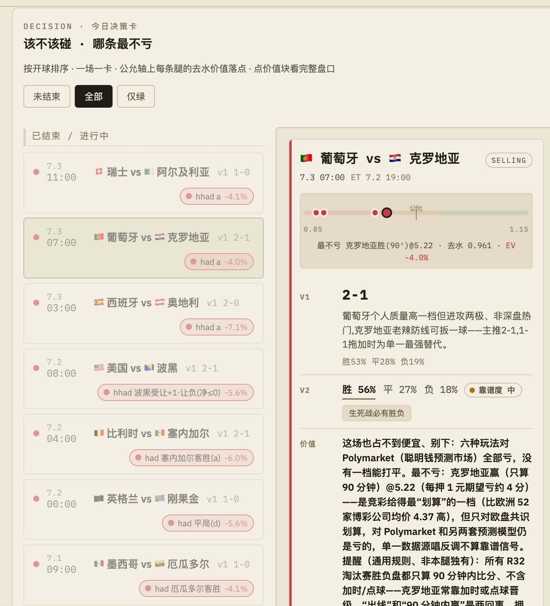
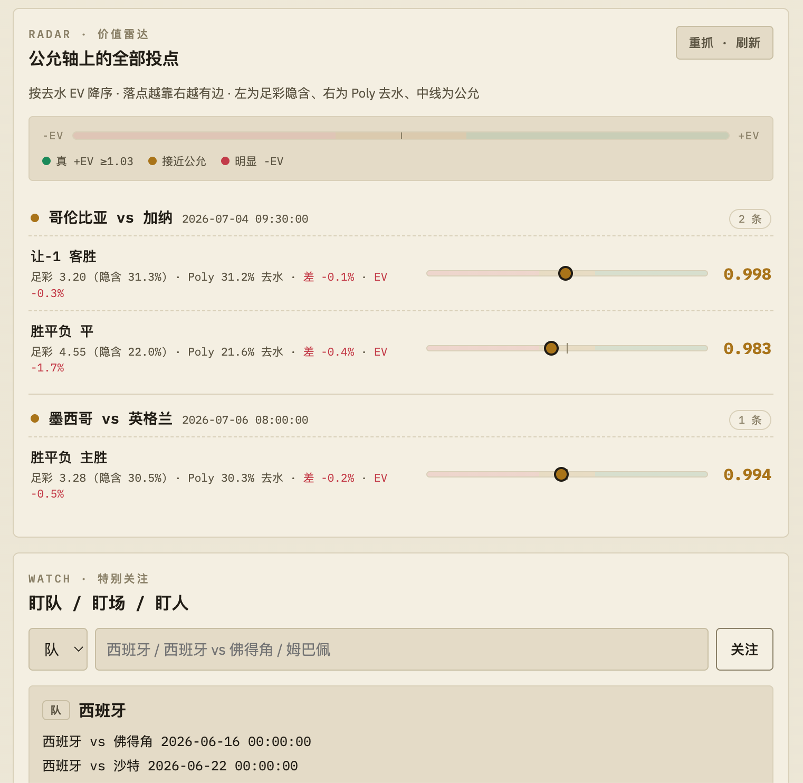
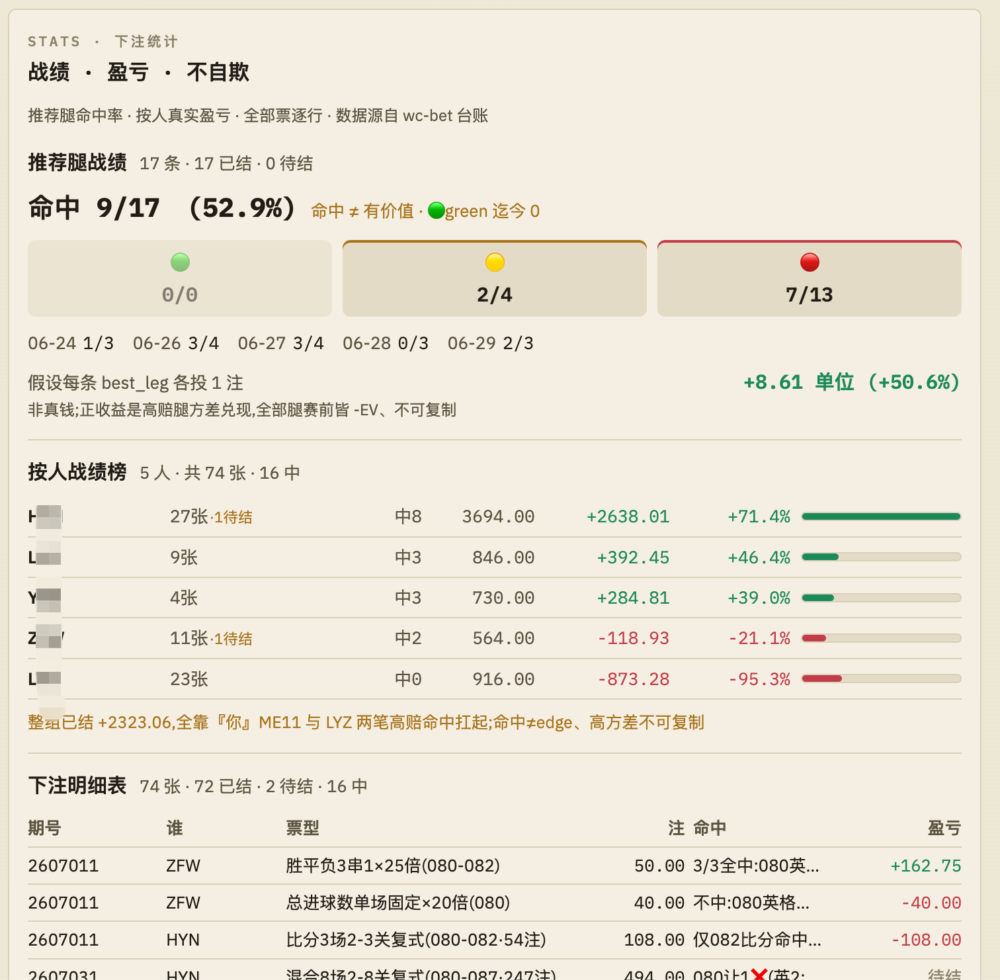
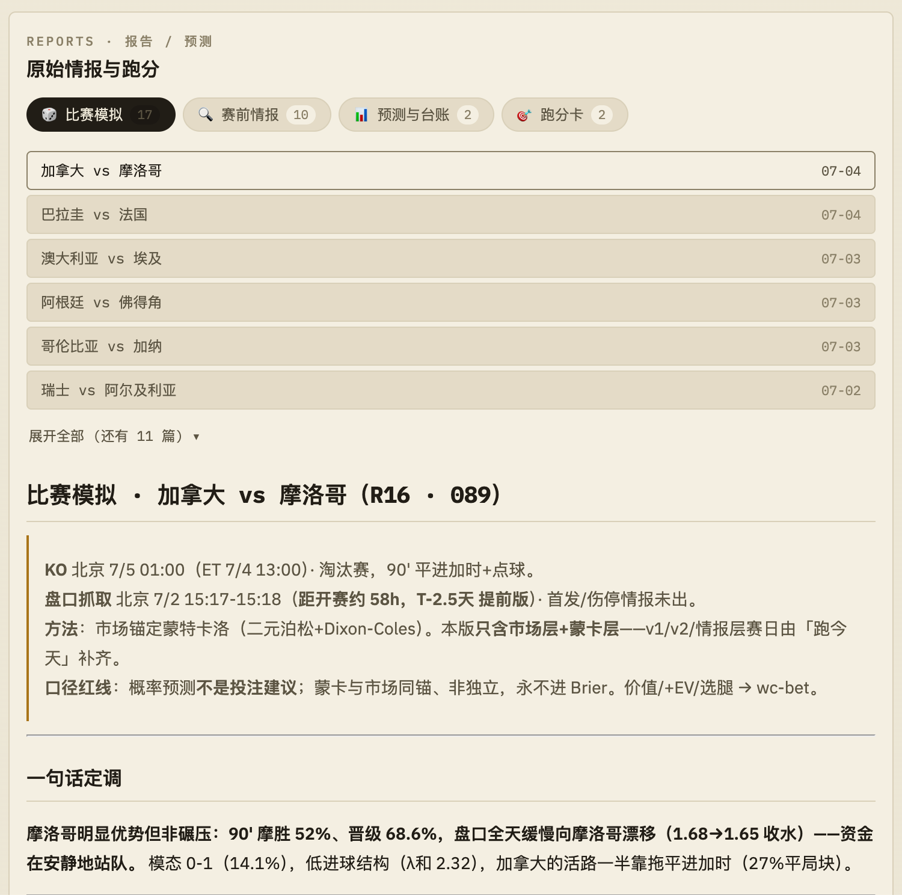
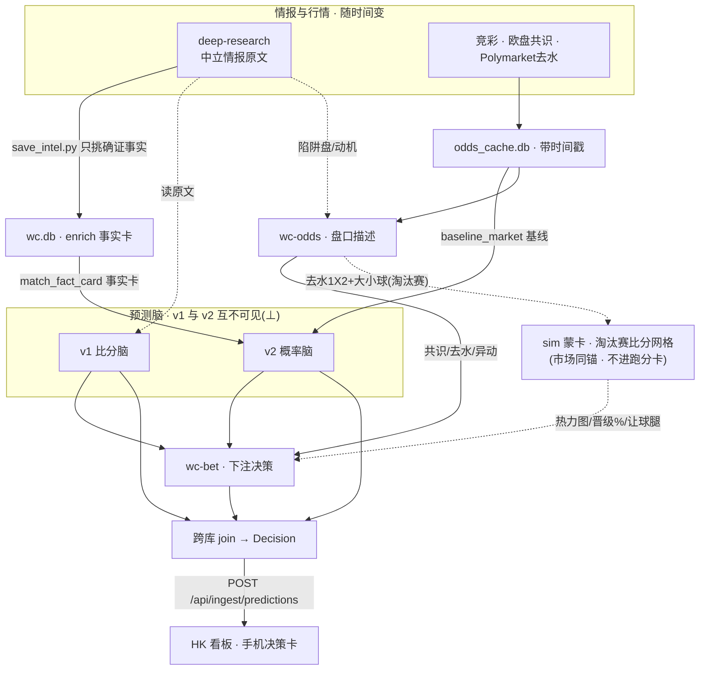

# fifa-world-cup-2026 — WC 预测 × 价值看板

世界杯 2026 的**每日预测 + 下注价值看板**。三套互相隔离的 AI 预测脑 + 一键编排，把
「今天哪几场、比分大概多少、胜平负概率多少、盘口有没有价值、哪条腿最不亏」
做成手机可扫读的**决策卡**，部署在 AWS-HK 实时访问。

> **一句话定位**：这不是稳定盈利机器。足彩长期是负期望（-EV），没有任何工具能改变这一点。
> 它不自动下注、不碰钱、不构成投资建议。它做的只有一件事——**用数据把「几乎必亏」改善成
> 「大致打平、偶尔薄赚 + 守住下限 + 不上头」，全程保持清醒。**

---

## 看板长这样

手机浏览器四页，全部由 AI 编排每日自动生成、回填、跑分：

<table>
  <tr>
    <td width="50%" valign="top">
      <b>① 决策卡 — 该不该碰 · 哪条最不亏</b><br/>
      按开球排序，一场一卡。公允轴上标出每条腿的去水价值落点，一眼看到「最不亏」的腿与 v1/v2 双脑判断。<br/><br/>
      
    </td>
    <td width="50%" valign="top">
      <b>② 价值雷达 — 公允轴上的全部投点</b><br/>
      所有腿按去水 EV 降序排在一条「-EV ↔ +EV」轴上，落点越靠右越有边际价值；下方可盯队/盯场/盯人。<br/><br/>
      
    </td>
  </tr>
  <tr>
    <td width="50%" valign="top">
      <b>③ 下注统计 — 战绩 · 盈亏 · 不自欺</b><br/>
      推荐腿命中率、按人真实盈亏榜、每张票逐行结算。刻意标注「命中 ≠ 有价值」「green 迄今 0」——数据保持诚实。<br/><br/>
      
    </td>
    <td width="50%" valign="top">
      <b>④ 报告 / 预测 — 原始情报与跑分</b><br/>
      赛前情报、三方跑分卡、淘汰赛蒙卡模拟（二元泊松 + Dixon-Coles）的完整推理留档。<br/><br/>
      
    </td>
  </tr>
</table>

> 📐 **架构总览** → [`docs/架构.md`](docs/架构.md)：四角色（情报粮草 + v1/v2/价值三脑）· 逻辑数据流 + 运行拓扑图 · 核心红线（v1⊥v2）· 置信度模型。

---

## 北极星：这其实是一场实证研究

比「帮你下注」更深一层——这个系统真正想回答的是 **LLM 独立推理 vs 市场（聪明钱）判断，到底谁在什么场合更准**。用一套会自我评测的预测系统，实证地回答**三对问题**：

1. **v1 独立推理 vs 市场共识** —— 从积分/出线诉求/动机直接推理，能不能赢过市场？
2. **v2（市场锚定 + 有据微调） vs 纯市场** —— 「照抄市场再打补丁」到底有没有加价值？（这是 v2 存在的生死考）
3. **v1 vs v2** —— 独立推理 与 贴市场 两种哲学，各自的主场在哪？

买票只是这套理解的**副产品**。系统的灵魂是 **Brier 三方对照（v1 / v2 / 市场基线）+ 按场型分桶跑分卡**，用来回答「什么场合该信市场，什么场合该信独立推理」。

> 这也正是为什么下文的 **v1 ⊥ v2 红线**不可妥协——两个脑一旦互相偷看就会相关，这场实证立刻失去对照组、Brier 跑分失真。红线不是洁癖，是这项研究成立的前提。

---

## 三条量化主线

整个系统的「硬核」浓缩成三步：**抓全三源盘口 → 去水还原真概率 → 淘汰赛建完整比分网格**。

### ① 三源抓盘

同时抓三个市场，交叉印证：

- **竞彩**（国内足彩）—— 你实际能下注的价格。
- **欧盘 47 家博彩公司共识**（500.com 翻页抓全，非只抓首屏 30 家）—— 全球庄家的一致看法。
- **Polymarket 去水**（预测市场的「聪明钱」）—— 真金白银押出来的概率。

三源看法一致 = 可信；分歧大 = 警报。单一数据源一边倒地唱反调，不算靠谱信号。

### ② 去水算价值

博彩赔率里含「水位」（庄家抽成），直接看赔率会**高估**真实概率。先给每个市场去水（devig）还原真概率，再算：

```
value = 竞彩欧赔 × Polymarket去水概率(真概率 p_true)
```

阈值（`backend/value.py` / `config.example.toml`）：

- 🟢 `value ≥ 1.03` +EV，可考虑
- 🟡 `0.97–1.03` 接近公允，守下限
- 🔴 `< 0.97` 明显 -EV，直接不进雷达
- ⚪ skip：高比分桶缺对应 O/U 线，不可靠

哪条腿最不亏，一眼可见（见决策卡「公允轴」与价值雷达）。

### ③ 蒙卡比分网格（淘汰赛）

淘汰赛没有平局、还有加时点球，单纯胜平负不够用。系统从**去水后的 1X2 + 大小球盘口**反解双方期望进球 λ，用**二元泊松 + Dixon-Coles 低比分修正**建出**完整比分概率网格**（直接解析解 = 无限次蒙卡的极限，无抽样噪声），再叠一层「加时 + 点球」晋级模型，与 Polymarket 晋级盘交叉验证。产出**比分热力图 / 让球腿命中率 / 晋级%**。

> 🔴 它**市场锚定、与 v2 同锚 → 非独立信号**，只供 wc-bet 决策内部用，**永不当 v1/v2 式预测、永不进 Brier 跑分卡**。纯 stdlib，`tools/sim_match_montecarlo.py --input '<json>'` 供编排化调用。

---

## 7-agent 工作流：一条流水线，六层职责

整套预测拆成**七个角色、分六层**，每层只干一件事、边界焊死：

| 层 | 角色 | 干什么 |
|---|---|---|
| 情报 | `wc-intel` | 多智能体深搜跑中立赛前情报（出线/伤停/历史），**只供料、不下结论**；只有「确证事实」（停赛/伤停/官宣轮换）才入库 |
| 预测 | `wc-score-v1` | 比分脑：从积分/出线形势独立推理出比分 + 自评胜平负% |
| 预测 | `wc-prob-v2` | 概率脑：锚定市场基线，有据才偏离，给胜平负概率 + 靠谱度（稳/中/乱）+ 剧本标签 |
| 描述 | `wc-odds` | 三源去水、报市场共识、竞彩 vs 共识分歧、盘口异动、陷阱盘结构——**只描述，不判价值** |
| 决策 | `wc-bet` | 综合上面所有 → value 分档 + 选最不亏的腿 + 评方案 + 讲结算 + 维护下注复盘台账 |
| 调度 | `wc-orchestrator` | 路由器：判断该唤醒谁、跑不跑深搜——**只发触发信号，绝不发判断内容** |
| 复盘 | `wc-review` | 赛后定性归因（样本够才上，且只产「假设」不下结论，裁判永远是定量跑分卡） |

> 七个角色是设计定格的完整骨架，目前落地为 **4 个独立 agent（v1/v2/odds/bet）+ 2 个 skill（情报深搜 / 编排）**，复盘脑是规划中的第七个。

### 🔴 v1 ⊥ v2 红线（不可妥协）

整条工作流的灵魂：**让比分脑（v1）和概率脑（v2）在预测那一刻互相看不见。**

靠的不是提示词求它别看，而是**编排脚本的结构保证**——`wc-predict-fanout` workflow 每场并行派三条独立 pass，v2 的输入是入参的纯函数，结构上根本不含任何 v1 的输出。为什么这么较真？因为终点要拿 **v1 / v2 / 市场基线**做三方 Brier 跑分（量化谁更准）。v2 一旦偷看 v1，两者相关，跑分立刻失真。红线靠自觉迟早会破，所以直接写进代码结构里。

v2 在预测时刻只能看到：市场基线 `baseline_market()` + 中立事实卡 `match_fact_card()`（停赛/伤停/官宣轮换）。**绝不**喂任何 v1 的比分/概率/推理。

---

## 架构

四个角色：**deepsearch 情报层** = 粮草（只供料、不下结论）；**v1 比分 / v2 概率 / 价值** = 三个互相隔离的脑。同一份料喂三脑、各产一份结论 → join 成**决策卡** → 推手机看板。三脑独立，所以「撞车 = 可信、分歧 = 警报」。



- 🔴 **红线**：v1 与 v2 预测时互不可见，否则三方 Brier 跑分（v1/v2/市场基线）失真
- ⏱ **新鲜度**：盘口取最新水位、intel 超 48h 不驱动偏离、WebFetch 同 URL 缓存 15min；陈旧 Poly 会伪造「假黄档」
- 🌐 **拓扑**：LLM 只能本地 Mac 跑（订阅制无 API key）；Polymarket 无人值守经本地 7897 代理直抓、交互式跑今天经 HK remote-agent 抓回；足彩走住宅代理过 WAF

### 三套预测脑（互不污染）

| 脑 | Agent | 产出 | 不做 |
|---|---|---|---|
| **v1 比分** | `wc-score-v1` | 出线形势 + 比分(主-客) + 自评胜平负% | 不算价值/EV |
| **v2 概率** | `wc-prob-v2` | 市场锚定胜平负概率 + 靠谱度(稳/中/乱) + 剧本标签 | 不出精确比分、不算 EV、不推下注 |
| **盘口描述** | `wc-odds` | 竞彩/Poly去水/欧盘共识三源、去水、市场共识、竞彩vs共识分歧、盘口异动、陷阱盘/结算结构 | 不下价值判断/不选腿 |
| **下注决策** | `wc-bet` | 综合 v1/v2/共识/价值 → value(🟢/🟡/🔴)+ 最不亏的腿 + 评方案 + 讲结算 + 维护下注复盘 | 不取盘口(找wc-odds)/不预测比分/不进跑分卡 |

---

## 一键编排：说一句「跑今天」

`.claude/skills/跑今天/SKILL.md` —— 每日 routine 一键化（~80% 自动化），7 步走完：

1. **按 ET 当下时刻**判定该预测哪几场（CST = ET+12/13；温哥华 PT = ET−3）
2. **刷三源盘口**：竞彩(本地直连) · 欧盘共识(500.com 去水) · Polymarket(HK 远程抓回)
   - **2.5 情报新鲜度闸**：fan-out 前查 `enrich` 事实卡，当天若全 >48h stale → v2 无新料可偏离会**静默空转**（照抄基线还不报警），空窗就补再 fan-out
3. **并行派三条独立 pass**（死守 v1⊥v2 红线）→ 各自写回缓存 + reports
4. 跑 **Brier 跑分卡**：`python3 tools/v2_report.py` → `reports/scoring/三方跑分卡.md`
5. **跨库 join 成决策对象** → POST `/api/ingest/predictions` 写回 HK 看板
6. 一段话给用户**扫读总结**
7. **诚实边界**：赛前~1h 首发微调窗仍需手动再触发一次（临场首发 + 末段盘口移动）

### 其它 skill

- **`数据快推`** —— 台账、报告这类纯数据改动，直接 POST 到看板接口，完全不走 git commit / PR / 部署。
- **`彩票入库`** —— 拍张彩票照片丢进暂存夹，自动读出期号/场次/玩法、规范命名归档，再自动派 wc-bet 补录下注台账。
- **`fifa-deploy`** —— 一句话把看板部署到香港实盘机（docker build + 滚动更新）。

---

## 决策卡 / 看板契约

后端 FastAPI（`backend/web.py`），前端原生 JS（决策 / 看板 / 报告 / 下注统计 四页）。
核心契约对象 **Decision**（详见 [`docs/superpowers/specs/2026-06-25-one-action-and-dashboard-redesign-CONTRACT.md`](docs/superpowers/specs/2026-06-25-one-action-and-dashboard-redesign-CONTRACT.md)）：

```jsonc
{
  "match_key": "韩国 vs 南非",
  "ko_bj": "6.27 02:00", "ko_et": "ET 6.26 14:00", "status": "Selling",
  "v1":    { "score": "0-1", "rationale": "韩平即出线", "probs": {"h":30,"d":30,"a":40} },
  "v2":    { "probs": {"h":38,"d":30,"a":32}, "reliability": "乱",
             "scenarios": ["默契平"], "deviated": true },
  "value": { "verdict": "该场别碰",
             "best_leg": {"desc":"南非 +0.5","flag":"yellow","ev_pct":-1.2} }
}
```

关键端点：`POST /api/ingest/predictions`（skill 写卡）· `GET /api/decisions`（前端读卡）·
`POST /api/refresh`（重抓+刷新）· `GET /api/bets/summary`（下注统计）· `GET /api/state`（价值雷达/记账，legacy）。Basic auth。

### 下注统计 / 战绩面板

`data/bet_ledger.json`（手整 5 人台账的结构化镜像）→ `backend/bet_stats.py` 聚合 → `GET /api/bets/summary`
→ 前端「下注统计」页：**推荐腿战绩**（分档命中/假设单位盈亏）+ **按人战绩榜** + **待结 / 已结**拆分。
`tools/settle_tickets.py` 按队名匹配终比分算让球/比分/复式/双选 payout。

> 这一页刻意做成「不自欺」：标注**命中 ≠ 有价值**，即便按人榜某些人账面为正，也注明**「全靠高赔腿方差兑现、全部腿赛前皆 -EV、不可复制」**。截图里「green 迄今 0」= 至今没抓到过一条真 +EV 的绿腿——这恰恰是诚实的证据，不是 bug。

---

## 深搜情报层

`/deep-research` 多智能体跑出中立赛前情报（出线形势/伤停/历史，**无预测**）→
抽取「确证事实」JSON → `python3 tools/save_intel.py` 写入 `data/wc.db` enrich 表 →
v2 经 `match_fact_card()` 取用。一份报告喂 v1/v2/价值三方各取所需；**只入确证事实**
（停赛/伤停/官宣轮换），叙事/动机/出线赔率不入此口。>48h 视为陈旧、不触发偏离。

---

## 目录速览

```
backend/   FastAPI + 预测/价值核心逻辑 (value.py, web.py, sporttery.py, bet_stats.py, baseline.py, intel.py)
frontend/  原生 JS + CSS 看板 (index.html, app.js, style.css；决策/看板/报告/下注统计 四页)
tools/     每日工具 (odds_watch / v2_report / save_intel / poly_fetch_hk / odds_consensus / refresh_all / backfill_results / sim_match_montecarlo / settle_tickets ...)
reports/   产出 md：agents/(wc-score-v1__比分预测 · wc-bet__下注复盘) / scoring/(三方跑分卡 · 复盘对错标) / intel/(*赛前情报*) ; _archive/ _state/ 非 live
data/      data/wc.db (HK 同步)　.cache/ 本地 odds_cache.db (不同步)
docs/      架构.md · images/(看板截图) · superpowers/specs(契约) + plans(计划)
.claude/   agents/ 4 agent(v1/v2/odds/bet) · skills/(跑今天/数据快推/彩票入库/fifa-deploy) · workflows/(wc-predict-fanout)
```

---

## 本地开发

```bash
pip install -r requirements.txt
python3 -m pytest -q                 # fixture 单测，不联网
python3 -m backend.run               # http://localhost:8000 (本地 IP 足彩可直连)
python3 tools/odds_watch.py --once   # 抓+缓存竞彩
python3 tools/odds_watch.py --consensus  # 竞彩 + 欧盘共识(500 全47家)一把抓
```

### 一把刷三源 + 推看板：`refresh_all`

本地**单一定时任务**刷三源（竞彩 sporttery + 欧盘 500 翻页 + **Poly 经本地 7897 代理直抓**）→ 写本地缓存 → 按队名对齐到 `zucai_num`、算变化 + 分歧 → POST HK 看板两端点（`/api/ingest/zucai` 竞彩 raw、`/api/ingest/odds` 赔率面板）。

```bash
WC_HTTPS_PROXY=http://127.0.0.1:7897 WC_INGEST_PW=<看板密码> \
  python3 tools/refresh_all.py --once            # 跑一次
python3 tools/refresh_all.py --once --dry-run     # 抓+对齐但不推 HK(冒烟)
```

> 订阅制约束：LLM 推理只能在本地 macOS 登录态下跑（无 API key），HK 后端不直调模型。
> Polymarket 本地受 GFW 限制——经**本地 7897 代理**(Clash/日本节点)直抓即可。

---

## 部署到 AWS-HK

HK 机房 **Polymarket 直连可达**，但 **足彩被 EdgeOne WAF 按 IP 拦**（数据中心 IP 中招），
足彩流量须走一个出口能过 WAF 的**住宅 SOCKS5 代理**（`[zucai] proxy = "socks5://..."`）。

```bash
git clone <repo> && cd fifa-world-cup-2026
cp config.example.toml config.toml          # 改 password、填 [zucai] proxy
docker compose up -d --build                # host network
curl -u user:<password> localhost:8000/api/state
```

手机浏览器开 `http://<HK-IP>:8000`（建议加 Nginx + HTTPS + basic-auth）。

---

## 文档

- **架构总览**：[`docs/架构.md`](docs/架构.md) —— 系统级：四角色 + 数据流 + 运行拓扑 + 核心不变量 + 置信度模型
- 看板设计：[`docs/superpowers/specs/2026-06-15-wc-value-dashboard-design.md`](docs/superpowers/specs/2026-06-15-wc-value-dashboard-design.md)
- 一键 + 看板重构契约：[`docs/superpowers/specs/2026-06-25-one-action-and-dashboard-redesign-CONTRACT.md`](docs/superpowers/specs/2026-06-25-one-action-and-dashboard-redesign-CONTRACT.md)
- v2 概率脑设计：[`docs/superpowers/specs/2026-06-25-wc-prediction-v2-design.md`](docs/superpowers/specs/2026-06-25-wc-prediction-v2-design.md)
- 7-agent 编排 + 三层边界：[`docs/design/2026-06-27-7agent编排-三层边界-设计.md`](docs/design/2026-06-27-7agent编排-三层边界-设计.md)

---

## 状态

v1 后端/前端 + v2 概率脑 + 三方 Brier 跑分 + 赛果自动回填闭环（launchd 每 5min，跑分卡 n>0）+ 一键编排（含情报新鲜度闸）
+ 决策卡看板 + 淘汰赛蒙卡支路 + 下注统计/战绩面板均已落地。
真·端到端（实连两平台）依赖 HK 部署 + 足彩代理就位后验证。

> **再说一遍**：这是一个帮你**保持清醒**的工具，不是帮你**赚钱**的工具。玩得开心，别上头。
