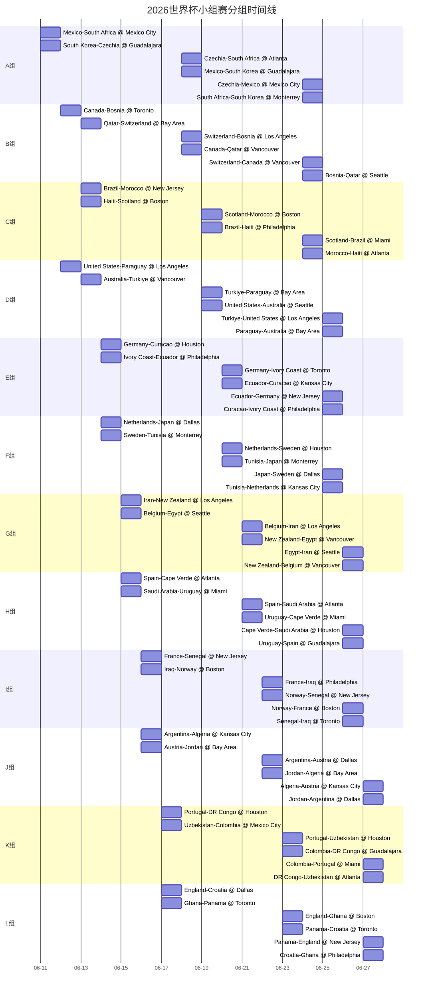

# 2026年FIFA世界杯小组赛出线与逐场胜平负概率深度研究报告

## 执行摘要

2026年世界杯是扩军后首届正赛：48队、12个小组、104场比赛，小组赛每组前两名与成绩最好的8个第三名晋级32强。这意味着"出线概率"不能只看前二名，还必须评估第三名横向比较的路径价值。赛程与主办城市横跨美国、加拿大、墨西哥三国、16座球场。

> [!abstract] 核心结论
> **西班牙、阿根廷、英格兰、法国、巴西、瑞士、德国、墨西哥** 是小组赛阶段最稳的八支球队。按本模型"晋级32强概率"：
> - 西班牙 **97.54%**
> - 阿根廷 **94.89%**
> - 英格兰 **93.76%**
> - 法国 **92.35%**
> - 巴西 **91.71%**

这些队伍兼具高 Elo、高总身价、较成熟的阵容稳定性，且所在分组普遍没有三支以上的高评级竞争者。公开赔率口径中，西班牙、法国、英格兰位于最靠前一档。

> [!warning] "高压组"警示
> **D组、I组、F组、K组** 最接近"高压组"：D组四队晋级概率分别为 80.73% / 68.29% / 65.42% / 57.26%；I组法国领先，但挪威与塞内加尔都处在真正可出线区间；F组与K组也存在明确的第三名竞争价值。

> [!tip] 环境与赛程
> - **墨西哥城/瓜达拉哈拉**：高海拔，对客队恢复与冲刺强度产生边际影响
> - **休斯敦、迈阿密、亚特兰大**：高温湿热，6月日高温约 86–92°F
> - **西雅图、加拿大城市**：整体温和，约 69–74°F

赔率说明：bet365 对 **Mexico vs South Africa** 给出明显偏向主队的赔率结构，对 **South Korea vs Czechia** 给出近乎五五开；本模型输出与市场方向基本一致。

---

## 数据与方法

> [!info] 数据来源
> - **赛事结构**：世界杯公开赛程、分组与主办地信息
> - **球队强度**：World Football Elo Ratings
> - **资源上限**：Transfermarkt 2026世界杯参赛队总身价
> - **排名**：赛前最新 FIFA 世界排名
> - **赔率**：bet365 各组赔率与首轮 1X2 样本
> - **气候**：WeatherSpark、AccuWeather 月度气候资料

### 量化模型

**第一层：逐场赛前强度差**

$$
\text{Base Strength} = \text{Elo} + 22 \times \ln\left(\frac{\text{Team Value}}{\text{Median Value}}\right) + \text{Manual Availability Adjustment}
$$

比赛层面修正（均为小幅封顶，避免主观噪音盖过长期能力指标）：

- 主办国本土作战加成（墨西哥、加拿大、美国）
- 休整天数差
- 连续比赛城市间旅行距离差
- 环境压力修正（高海拔、湿热）
- 可验证伤停/后勤负面修正（加拿大首战关键缺席、伊朗签证扰动、荷兰进攻端伤缺等）

**第二层：Poisson 进球模拟 + Monte Carlo 小组赛仿真**

强度差映射为期望总进球与两队进球份额，Poisson 分布生成比分，随后进行 **200,000次** 全量模拟，统计每队的**小组前二概率（top2）**与**晋级32强概率（advance）**。

> [!note] 赔率使用说明
> 截至 2026-06-11，并非全部 72 场都能稳定抓取同口径 1X2 与亚洲让球水位。本报告将盘口主要用作**外部校准**，而非每场直接输入。文中"隐含赔率"为**模型概率倒数得到的理论赔率**，不等同于统一时点博彩市场实盘。

---

## 全局判断

把小组赛看成"晋级32强"问题（而非"必须前二"），产生三个重要结论：

1. **强队安全垫更厚**：西班牙、阿根廷、英格兰等即使出现意外失分，大概率仍以头名或次名直接晋级
2. **死亡组不一定有绝对豪门**：D组、I组这样的"第三名也可能高分出线"的组更值得关注
3. **主办国红利不对称**：墨西哥红利最特殊（主场+海拔+赛程路径叠加）；加拿大赛程最平顺；美国虽在本国，但D组竞争强度相对更高

### 最稳12队晋级概率

| 球队 | 小组 | 晋级概率 | 前二概率 |
|:--|:--:|--:|--:|
| Spain | H | 97.54% | 92.55% |
| Argentina | J | 94.89% | 87.13% |
| England | L | 93.76% | 83.99% |
| France | I | 92.35% | 80.25% |
| Brazil | C | 91.71% | 80.12% |
| Switzerland | B | 91.69% | 79.73% |
| Germany | E | 91.17% | 76.85% |
| Mexico | A | 90.87% | 79.15% |
| Ecuador | E | 90.30% | 75.03% |
| Belgium | G | 89.89% | 78.40% |
| Portugal | K | 89.07% | 76.72% |
| Canada | B | 88.42% | 73.95% |

> [!example] 冷门热力图
> 最容易爆出"非强队赢球"的比赛不是豪门对弱旅，而是接近均势的中档对撞：
> **South Korea vs Czechia、Switzerland vs Canada、Norway vs Senegal、Cape Verde vs Saudi Arabia、Colombia vs Portugal、DR Congo vs Uzbekistan**
> 这类比赛"弱势一方取胜概率"普遍在 **30%–35%**，足以实质性改变小组第三名横向排名。

---

## 分组研判

### A组

> [!tip] 头名大热：Mexico
> Elo、FIFA排名与总身价均高于同组其余三队，三场全在墨西哥境内完成。墨西哥城与瓜达拉哈拉的高海拔对客队恢复与节奏构成实际差异，AP揭幕战报道中明确提醒这一点。bet365 赛前组盘也把墨西哥放在最清晰的优势位。

第二名几乎是韩国和捷克的硬币边。模型稍偏韩国：Elo略占优、总身价差距不大，首战若不败就掌握主动。bet365揭幕轮预览指出韩国对捷克"两队目前无伤停报告"。

### B组

> [!note] 市场共识：Switzerland + Canada
> 瑞士总身价、门将位置上限和稳定性更高（Transfermarkt：€332.50m，Kobel/Xhaka/Ndoye/Okafor等高价值点）。加拿大三战均在加拿大完成，主办国赛程优势明显。

关键变量：bet365赛前预览明确提到队长 **Alphonso Davies** 仍在恢复中、对波黑预计缺席，Bombito 也有伤，这解释了加拿大首战赢面未被模型抬到"碾压"的原因。波黑是本组最有希望以第三名上岸的球队；卡塔尔在 Elo 和总身价上明显落后。

### C组

> [!note] 巴西领头，但不像西班牙那样"无悬念"
> 巴西在 Carlo Ancelotti 手下带着极高上限进入赛事，但新主教练周期意味着体系稳定性略逊于传统成熟豪门。摩洛哥拥有扎实中后场硬度、Achraf Hakimi 单点爆发，总身价接近 €500m。

苏格兰的 Elo 高于很多人的直觉值，与摩洛哥的第二轮对撞直接决定本组第三名质量。苏格兰真正具备把组内排序搅乱的能力。

### D组

> [!warning] 全组四队均有现实晋级路径
> bet365 已把 D 组定义为"非常胶着"的小组，四队 FIFA 排名区间相互咬住。土耳其 Elo、总身价和近期上升势头最强；巴拉圭凭南美出线质量略压主办国美国。

美国的 D 组并不像墨西哥那样有海拔+赛程半封闭优势，三战分布在洛杉矶—西雅图—洛杉矶，竞争强度不轻。澳大利亚 57% 的晋级概率说明它完全可能以第三名突围。

### E组

> [!note] 双强 + 一支硬骨头 + 一支外卡
> 德国和厄瓜多尔 Elo 非常接近（厄瓜多尔甚至略高于德国）。德国优势在总身价与阵容深度，厄瓜多尔优势在组织度、出线路径质量与美洲环境适应性。科特迪瓦总身价高于厄瓜多尔但 Elo 明显低一档，说明"个体资源"尚未完全稳定转化为持续结果。

结论：德国、厄瓜多尔最可能直接前二，科特迪瓦是强烈的第三名候选。

### F组

> [!note] 荷兰领头，日本紧追
> 由于 **Xavi Simons 的 ACL 伤缺**，荷兰进攻前场创造力有所削弱，日本的贴身程度非常高。bet365 特别提到日本赛前赢下包括巴西、英格兰在内的系列比赛并连续零封，在"稳定拿分"维度比很多人想象得更强。真正的第三名竞争者是瑞典，而不是突尼斯。

### G组

> [!note] 最有意思的变量：伊朗 vs 埃及
> 比利时在 Elo、总身价和市场组盘上明显领先。伊朗 Elo 略高于埃及，但埃及拥有更高市场价值和 Mohamed Salah 这种比赛决定者。

> [!warning] 伊朗后勤扰动
> Reuters/CNA 明确报道：伊朗球员赴美签证赛前获批，但部分技术与行政人员签证仍未完全解决，球队基地转到墨西哥蒂华纳，旅行与后勤正常性明显受扰。这是模型对伊朗施加小幅负向修正的主要依据。

### H组

> [!success] 最标准的"双头组"
> 西班牙在 Elo、总身价、市场赔率和阵容深度上几乎都把本组拉开了一层。bet365 直接定义西班牙为"应当相对轻松通过小组赛"的球队。

关键变量：**Lamine Yamal** 在4月腿筋受伤后一直被谨慎管理，主帅表示若无反复首战 Cape Verde 可出场，Nico Williams 与 Víctor Muñoz 也接近可用。乌拉圭维持强劲二号位；沙特与佛得角的竞争主要在"谁能拿到高质量第三"。

### I组

> [!warning] 本届最接近"死亡组"之一
> bet365 明确把法国、塞内加尔、挪威称为"都带着高期待而来"的三强格局。挪威以完美战绩、37进球5失球完成预选赛。

模型把挪威压过塞内加尔的原因：Haaland + Ødegaard 的高端创造/终结组合在身价与 Elo 中都有体现，且首轮对伊拉克更适合作为稳拿3分的起点。法国仍稳，但如果本组二强之一以第三名出线，不会令人惊讶。

### J组

> [!success] 阿根廷独走
> 卫冕冠军阿根廷是本组最清晰的头名大热，模型给出 94.89% 晋级概率和 87.13% 前二概率。

分歧在第二名：模型偏奥地利（Elo略高、攻守平衡更稳定），阿尔及利亚更依赖单场冲击。整体格局："阿根廷独走、第二名与高质量第三名双线程竞争"。

### K组

> [!note] 两强+不弱的第三名
> 葡萄牙与哥伦比亚差距很小：89.07% vs 87.05%。赛程路径对葡萄牙尤其友好（前两战在休斯敦，第三战迈阿密）；哥伦比亚要经历墨西哥城高海拔、瓜达拉哈拉，再转到迈阿密。

乌兹别克斯坦并非背景板：48.80% 的晋级概率说明它很可能以第三名参与竞争；刚果（金）也有 41.05%。本组第三名的积分和净胜球极可能进入"最佳八个第三名"的讨论。

### L组

> [!note] 头重脚轻，但第三名不弱
> 英格兰（93.76%）与克罗地亚（85.37%）领跑。巴拿马有 57.00% 的晋级概率——即便前二难度大，也非常可能以第三名过关。

关键场次：英格兰与克罗地亚首战直接碰撞含义很大。若英格兰拿下，巴拿马的第三名路径被明显放大；若平局，后两轮会更黏。

各组最可能晋级两队总览（"晋级概率"指进入32强）：

| 小组 | 队一 | 晋级概率 | 前二概率 | 队二 | 晋级概率 | 前二概率 |
|:--:|:--|--:|--:|:--|--:|--:|
| A | Mexico | 90.87% | 79.15% | South Korea | 73.71% | 53.16% |
| B | Switzerland | 91.69% | 79.73% | Canada | 88.42% | 73.95% |
| C | Brazil | 91.71% | 80.12% | Morocco | 77.75% | 57.85% |
| D | Türkiye | 80.73% | 65.13% | Paraguay | 68.29% | 49.54% |
| E | Germany | 91.17% | 76.85% | Ecuador | 90.30% | 75.03% |
| F | Netherlands | 87.55% | 74.10% | Japan | 82.41% | 66.20% |
| G | Belgium | 89.89% | 78.40% | Iran | 70.22% | 50.76% |
| H | Spain | 97.54% | 92.55% | Uruguay | 85.29% | 71.21% |
| I | France | 92.35% | 80.25% | Norway | 79.28% | 58.31% |
| J | Argentina | 94.89% | 87.13% | Austria | 70.02% | 50.75% |
| K | Portugal | 89.07% | 76.72% | Colombia | 87.05% | 73.26% |
| L | England | 93.76% | 83.99% | Croatia | 85.37% | 69.57% |

---

## 全部七十二场比赛概率表

> [!info] 说明
> **主胜/平/客胜概率** 为本报告模型输出；**隐含赔率** 为模型概率倒数得到的十进制理论赔率，不等同于统一时点博彩公司实盘；**冷门概率** 指该场低强度一方直接赢球的概率。

### A组

| 日期 | 对阵 | 城市/球场 | 主胜 | 平 | 客胜 | 主胜赔率 | 平赔 | 客胜赔率 | 冷门概率 |
|:--|:--|:--|--:|--:|--:|--:|--:|--:|--:|
| 2026-06-11 | Mexico vs South Africa | Mexico City / Estadio Azteca | 67.73% | 20.91% | 11.36% | 1.48 | 4.78 | 8.80 | 11.36% |
| 2026-06-11 | South Korea vs Czechia | Guadalajara / Estadio Akron | 36.60% | 28.33% | 35.07% | 2.73 | 3.53 | 2.85 | 35.07% |
| 2026-06-18 | Czechia vs South Africa | Atlanta / Mercedes-Benz Stadium | 53.47% | 25.65% | 20.88% | 1.87 | 3.90 | 4.79 | 20.88% |
| 2026-06-18 | Mexico vs South Korea | Guadalajara / Estadio Akron | 49.32% | 26.62% | 24.06% | 2.03 | 3.76 | 4.16 | 24.06% |
| 2026-06-24 | Czechia vs Mexico | Mexico City / Estadio Azteca | 22.80% | 26.26% | 50.94% | 4.39 | 3.81 | 1.96 | 22.80% |
| 2026-06-24 | South Africa vs South Korea | Monterrey / Estadio BBVA | 19.81% | 25.26% | 54.93% | 5.05 | 3.96 | 1.82 | 19.81% |

### B组

| 日期 | 对阵 | 城市/球场 | 主胜 | 平 | 客胜 | 主胜赔率 | 平赔 | 客胜赔率 | 冷门概率 |
|:--|:--|:--|--:|--:|--:|--:|--:|--:|--:|
| 2026-06-12 | Canada vs Bosnia & Herzegovina | Toronto / BMO Field | 53.90% | 25.54% | 20.56% | 1.86 | 3.92 | 4.86 | 20.56% |
| 2026-06-13 | Qatar vs Switzerland | San Francisco Bay Area / Levis Stadium | 9.46% | 19.49% | 71.05% | 10.57 | 5.13 | 1.41 | 9.46% |
| 2026-06-18 | Switzerland vs Bosnia & Herzegovina | Los Angeles / SoFi Stadium | 58.18% | 24.32% | 17.50% | 1.72 | 4.11 | 5.71 | 17.50% |
| 2026-06-18 | Canada vs Qatar | Vancouver / BC Place | 67.90% | 20.84% | 11.26% | 1.47 | 4.80 | 8.88 | 11.26% |
| 2026-06-24 | Switzerland vs Canada | Vancouver / BC Place | 39.22% | 28.14% | 32.64% | 2.55 | 3.55 | 3.06 | 32.64% |
| 2026-06-24 | Bosnia & Herzegovina vs Qatar | Seattle / Lumen Field | 51.16% | 26.21% | 22.63% | 1.95 | 3.82 | 4.42 | 22.63% |

### C组

| 日期 | 对阵 | 城市/球场 | 主胜 | 平 | 客胜 | 主胜赔率 | 平赔 | 客胜赔率 | 冷门概率 |
|:--|:--|:--|--:|--:|--:|--:|--:|--:|--:|
| 2026-06-13 | Brazil vs Morocco | New York/New Jersey / MetLife Stadium | 48.25% | 26.83% | 24.92% | 2.07 | 3.73 | 4.01 | 24.92% |
| 2026-06-13 | Haiti vs Scotland | Boston / Gillette Stadium | 20.28% | 25.44% | 54.29% | 4.93 | 3.93 | 1.84 | 20.28% |
| 2026-06-19 | Scotland vs Morocco | Boston / Gillette Stadium | 31.40% | 28.01% | 40.59% | 3.18 | 3.57 | 2.46 | 31.40% |
| 2026-06-19 | Brazil vs Haiti | Philadelphia / Lincoln Financial Field | 69.47% | 20.18% | 10.34% | 1.44 | 4.96 | 9.67 | 10.34% |
| 2026-06-24 | Scotland vs Brazil | Miami / Hard Rock Stadium | 20.95% | 25.67% | 53.38% | 4.77 | 3.90 | 1.87 | 20.95% |
| 2026-06-24 | Morocco vs Haiti | Atlanta / Mercedes-Benz Stadium | 58.88% | 24.11% | 17.01% | 1.70 | 4.15 | 5.88 | 17.01% |

### D组

| 日期 | 对阵 | 城市/球场 | 主胜 | 平 | 客胜 | 主胜赔率 | 平赔 | 客胜赔率 | 冷门概率 |
|:--|:--|:--|--:|--:|--:|--:|--:|--:|--:|
| 2026-06-12 | United States vs Paraguay | Los Angeles / SoFi Stadium | 34.78% | 28.31% | 36.91% | 2.88 | 3.53 | 2.71 | 34.78% |
| 2026-06-13 | Australia vs Türkiye | Vancouver / BC Place | 24.68% | 26.77% | 48.55% | 4.05 | 3.73 | 2.06 | 24.68% |
| 2026-06-19 | Türkiye vs Paraguay | San Francisco Bay Area / Levis Stadium | 42.26% | 27.81% | 29.92% | 2.37 | 3.60 | 3.34 | 29.92% |
| 2026-06-19 | United States vs Australia | Seattle / Lumen Field | 39.17% | 28.15% | 32.68% | 2.55 | 3.55 | 3.06 | 32.68% |
| 2026-06-25 | Türkiye vs United States | Los Angeles / SoFi Stadium | 45.31% | 27.37% | 27.33% | 2.21 | 3.65 | 3.66 | 27.33% |
| 2026-06-25 | Paraguay vs Australia | San Francisco Bay Area / Levis Stadium | 41.18% | 27.94% | 30.88% | 2.43 | 3.58 | 3.24 | 30.88% |

### E组

| 日期 | 对阵 | 城市/球场 | 主胜 | 平 | 客胜 | 主胜赔率 | 平赔 | 客胜赔率 | 冷门概率 |
|:--|:--|:--|--:|--:|--:|--:|--:|--:|--:|
| 2026-06-14 | Germany vs Curaçao | Houston / NRG Stadium | 73.04% | 18.59% | 8.38% | 1.37 | 5.38 | 11.94 | 8.38% |
| 2026-06-14 | Ivory Coast vs Ecuador | Philadelphia / Lincoln Financial Field | 21.49% | 25.85% | 52.66% | 4.65 | 3.87 | 1.90 | 21.49% |
| 2026-06-20 | Germany vs Ivory Coast | Toronto / BMO Field | 53.34% | 25.68% | 20.98% | 1.87 | 3.89 | 4.77 | 20.98% |
| 2026-06-20 | Ecuador vs Curaçao | Kansas City / Arrowhead Stadium | 72.47% | 18.85% | 8.68% | 1.38 | 5.31 | 11.52 | 8.68% |
| 2026-06-25 | Ecuador vs Germany | New York/New Jersey / MetLife Stadium | 34.58% | 28.30% | 37.12% | 2.89 | 3.53 | 2.69 | 34.58% |
| 2026-06-25 | Curaçao vs Ivory Coast | Philadelphia / Lincoln Financial Field | 16.78% | 24.00% | 59.22% | 5.96 | 4.17 | 1.69 | 16.78% |

### F组

| 日期 | 对阵 | 城市/球场 | 主胜 | 平 | 客胜 | 主胜赔率 | 平赔 | 客胜赔率 | 冷门概率 |
|:--|:--|:--|--:|--:|--:|--:|--:|--:|--:|
| 2026-06-14 | Netherlands vs Japan | Dallas / AT&T Stadium | 40.08% | 28.06% | 31.86% | 2.50 | 3.56 | 3.14 | 31.86% |
| 2026-06-14 | Sweden vs Tunisia | Monterrey / Estadio BBVA | 44.56% | 27.49% | 27.96% | 2.24 | 3.64 | 3.58 | 27.96% |
| 2026-06-20 | Netherlands vs Sweden | Houston / NRG Stadium | 53.18% | 25.72% | 21.10% | 1.88 | 3.89 | 4.74 | 21.10% |
| 2026-06-20 | Tunisia vs Japan | Monterrey / Estadio BBVA | 18.17% | 24.62% | 57.21% | 5.50 | 4.06 | 1.75 | 18.17% |
| 2026-06-25 | Japan vs Sweden | Dallas / AT&T Stadium | 48.66% | 26.75% | 24.58% | 2.05 | 3.74 | 4.07 | 24.58% |
| 2026-06-25 | Tunisia vs Netherlands | Kansas City / Arrowhead Stadium | 15.25% | 23.25% | 61.51% | 6.56 | 4.30 | 1.63 | 15.25% |

### G组

| 日期 | 对阵 | 城市/球场 | 主胜 | 平 | 客胜 | 主胜赔率 | 平赔 | 客胜赔率 | 冷门概率 |
|:--|:--|:--|--:|--:|--:|--:|--:|--:|--:|
| 2026-06-15 | Iran vs New Zealand | Los Angeles / SoFi Stadium | 49.17% | 26.65% | 24.18% | 2.03 | 3.75 | 4.14 | 24.18% |
| 2026-06-15 | Belgium vs Egypt | Seattle / Lumen Field | 52.43% | 25.91% | 21.66% | 1.91 | 3.86 | 4.62 | 21.66% |
| 2026-06-21 | Belgium vs Iran | Los Angeles / SoFi Stadium | 50.24% | 26.42% | 23.34% | 1.99 | 3.79 | 4.28 | 23.34% |
| 2026-06-21 | New Zealand vs Egypt | Vancouver / BC Place | 25.36% | 26.94% | 47.70% | 3.94 | 3.71 | 2.10 | 25.36% |
| 2026-06-26 | Egypt vs Iran | Seattle / Lumen Field | 34.42% | 28.29% | 37.29% | 2.90 | 3.53 | 2.68 | 34.42% |
| 2026-06-26 | New Zealand vs Belgium | Vancouver / BC Place | 14.39% | 22.78% | 62.83% | 6.95 | 4.39 | 1.59 | 14.39% |

### H组

| 日期 | 对阵 | 城市/球场 | 主胜 | 平 | 客胜 | 主胜赔率 | 平赔 | 客胜赔率 | 冷门概率 |
|:--|:--|:--|--:|--:|--:|--:|--:|--:|--:|
| 2026-06-15 | Spain vs Cape Verde | Atlanta / Mercedes-Benz Stadium | 76.09% | 17.11% | 6.80% | 1.31 | 5.85 | 14.70 | 6.80% |
| 2026-06-15 | Saudi Arabia vs Uruguay | Miami / Hard Rock Stadium | 15.34% | 23.29% | 61.36% | 6.52 | 4.29 | 1.63 | 15.34% |
| 2026-06-21 | Spain vs Saudi Arabia | Atlanta / Mercedes-Benz Stadium | 76.58% | 16.86% | 6.56% | 1.31 | 5.93 | 15.24 | 6.56% |
| 2026-06-21 | Uruguay vs Cape Verde | Miami / Hard Rock Stadium | 61.03% | 23.41% | 15.56% | 1.64 | 4.27 | 6.43 | 15.56% |
| 2026-06-26 | Cape Verde vs Saudi Arabia | Houston / NRG Stadium | 36.30% | 28.35% | 35.35% | 2.75 | 3.53 | 2.83 | 35.35% |
| 2026-06-26 | Uruguay vs Spain | Guadalajara / Estadio Akron | 18.99% | 24.95% | 56.06% | 5.27 | 4.01 | 1.78 | 18.99% |

### I组

| 日期 | 对阵 | 城市/球场 | 主胜 | 平 | 客胜 | 主胜赔率 | 平赔 | 客胜赔率 | 冷门概率 |
|:--|:--|:--|--:|--:|--:|--:|--:|--:|--:|
| 2026-06-16 | France vs Senegal | New York/New Jersey / MetLife Stadium | 52.17% | 25.97% | 21.85% | 1.92 | 3.85 | 4.58 | 21.85% |
| 2026-06-16 | Iraq vs Norway | Boston / Gillette Stadium | 14.67% | 22.94% | 62.39% | 6.82 | 4.36 | 1.60 | 14.67% |
| 2026-06-22 | France vs Iraq | Philadelphia / Lincoln Financial Field | 72.00% | 19.06% | 8.93% | 1.39 | 5.25 | 11.19 | 8.93% |
| 2026-06-22 | Norway vs Senegal | New York/New Jersey / MetLife Stadium | 39.88% | 28.08% | 32.04% | 2.51 | 3.56 | 3.12 | 32.04% |
| 2026-06-26 | Norway vs France | Boston / Gillette Stadium | 25.17% | 26.90% | 47.94% | 3.97 | 3.72 | 2.09 | 25.17% |
| 2026-06-26 | Senegal vs Iraq | Toronto / BMO Field | 58.60% | 24.19% | 17.21% | 1.71 | 4.13 | 5.81 | 17.21% |

### J组

| 日期 | 对阵 | 城市/球场 | 主胜 | 平 | 客胜 | 主胜赔率 | 平赔 | 客胜赔率 | 冷门概率 |
|:--|:--|:--|--:|--:|--:|--:|--:|--:|--:|
| 2026-06-16 | Argentina vs Algeria | Kansas City / Arrowhead Stadium | 61.59% | 23.21% | 15.19% | 1.62 | 4.31 | 6.58 | 15.19% |
| 2026-06-16 | Austria vs Jordan | San Francisco Bay Area / Levis Stadium | 50.49% | 26.36% | 23.15% | 1.98 | 3.79 | 4.32 | 23.15% |
| 2026-06-22 | Argentina vs Austria | Dallas / AT&T Stadium | 58.22% | 24.31% | 17.47% | 1.72 | 4.11 | 5.72 | 17.47% |
| 2026-06-22 | Jordan vs Algeria | San Francisco Bay Area / Levis Stadium | 26.91% | 27.28% | 45.80% | 3.72 | 3.67 | 2.18 | 26.91% |
| 2026-06-27 | Algeria vs Austria | Kansas City / Arrowhead Stadium | 31.74% | 28.05% | 40.22% | 3.15 | 3.57 | 2.49 | 31.74% |
| 2026-06-27 | Jordan vs Argentina | Dallas / AT&T Stadium | 9.71% | 19.69% | 70.60% | 10.30 | 5.08 | 1.42 | 9.71% |

### K组

| 日期 | 对阵 | 城市/球场 | 主胜 | 平 | 客胜 | 主胜赔率 | 平赔 | 客胜赔率 | 冷门概率 |
|:--|:--|:--|--:|--:|--:|--:|--:|--:|--:|
| 2026-06-17 | Portugal vs DR Congo | Houston / NRG Stadium | 62.06% | 23.05% | 14.89% | 1.61 | 4.34 | 6.72 | 14.89% |
| 2026-06-17 | Uzbekistan vs Colombia | Mexico City / Estadio Azteca | 17.94% | 24.52% | 57.54% | 5.57 | 4.08 | 1.74 | 17.94% |
| 2026-06-23 | Portugal vs Uzbekistan | Houston / NRG Stadium | 59.05% | 24.05% | 16.90% | 1.69 | 4.16 | 5.92 | 16.90% |
| 2026-06-23 | Colombia vs DR Congo | Guadalajara / Estadio Akron | 60.80% | 23.48% | 15.72% | 1.64 | 4.26 | 6.36 | 15.72% |
| 2026-06-27 | Colombia vs Portugal | Miami / Hard Rock Stadium | 33.55% | 28.22% | 38.22% | 2.98 | 3.54 | 2.62 | 33.55% |
| 2026-06-27 | DR Congo vs Uzbekistan | Atlanta / Mercedes-Benz Stadium | 32.24% | 28.10% | 39.66% | 3.10 | 3.56 | 2.52 | 32.24% |

### L组

| 日期 | 对阵 | 城市/球场 | 主胜 | 平 | 客胜 | 主胜赔率 | 平赔 | 客胜赔率 | 冷门概率 |
|:--|:--|:--|--:|--:|--:|--:|--:|--:|--:|
| 2026-06-17 | England vs Croatia | Dallas / AT&T Stadium | 45.78% | 27.29% | 26.93% | 2.18 | 3.66 | 3.71 | 26.93% |
| 2026-06-17 | Ghana vs Panama | Toronto / BMO Field | 24.33% | 26.69% | 48.98% | 4.11 | 3.75 | 2.04 | 24.33% |
| 2026-06-23 | England vs Ghana | Boston / Gillette Stadium | 72.09% | 19.02% | 8.88% | 1.39 | 5.26 | 11.26 | 8.88% |
| 2026-06-23 | Panama vs Croatia | Toronto / BMO Field | 21.84% | 25.97% | 52.19% | 4.58 | 3.85 | 1.92 | 21.84% |
| 2026-06-27 | Panama vs England | New York/New Jersey / MetLife Stadium | 14.85% | 23.04% | 62.11% | 6.73 | 4.34 | 1.61 | 14.85% |
| 2026-06-27 | Croatia vs Ghana | Philadelphia / Lincoln Financial Field | 64.76% | 22.08% | 13.17% | 1.54 | 4.53 | 7.59 | 13.17% |

---

## 附录

### 小组赛分组时间线

### 48队评级、总身价与模型概率

| 小组 | 球队 | Elo | FIFA排名 | 总身价(€m) | 晋级概率 | 前二概率 |
|:--|:--|--:|--:|--:|--:|--:|
| A | Mexico | 1875 | 15 | 191.85 | 90.87% | 79.15% |
| A | South Korea | 1758 | 25 | 139.05 | 73.71% | 53.16% |
| A | Czechia | 1740 | 42 | 188.18 | 71.38% | 50.09% |
| A | South Africa | 1517 | 60 | 49.25 | 32.69% | 17.59% |
| B | Switzerland | 1891 | 19 | 332.50 | 91.69% | 79.73% |
| B | Canada | 1788 | 30 | 198.65 | 88.42% | 73.95% |
| B | Bosnia & Herzegovina | 1595 | 65 | 151.60 | 58.95% | 33.74% |
| B | Qatar | 1421 | 55 | 19.93 | 26.39% | 12.57% |
| C | Brazil | 1991 | 6 | 928.20 | 91.71% | 80.12% |
| C | Morocco | 1827 | 8 | 498.30 | 77.75% | 57.85% |
| C | Scotland | 1782 | 43 | 170.25 | 69.17% | 46.52% |
| C | Haiti | 1548 | 83 | 55.90 | 29.51% | 15.51% |
| D | Türkiye | 1911 | 22 | 473.70 | 80.73% | 65.13% |
| D | Paraguay | 1834 | 40 | 153.65 | 68.29% | 49.54% |
| D | United States | 1726 | 16 | 385.65 | 65.42% | 46.93% |
| D | Australia | 1777 | 27 | 77.45 | 57.26% | 38.40% |
| E | Germany | 1932 | 10 | 947.00 | 91.17% | 76.85% |
| E | Ecuador | 1938 | 23 | 368.70 | 90.30% | 75.03% |
| E | Ivory Coast | 1695 | 34 | 522.10 | 67.41% | 39.59% |
| E | Curaçao | 1434 | 82 | 25.78 | 19.31% | 8.52% |
| F | Netherlands | 1948 | 7 | 754.20 | 87.55% | 74.10% |
| F | Japan | 1906 | 18 | 270.85 | 82.41% | 66.20% |
| F | Sweden | 1712 | 38 | 406.08 | 59.21% | 37.52% |
| F | Tunisia | 1628 | 44 | 69.95 | 39.53% | 22.19% |
| G | Belgium | 1894 | 9 | 547.50 | 89.89% | 78.40% |
| G | Iran | 1772 | 21 | 32.05 | 70.22% | 50.76% |
| G | Egypt | 1696 | 29 | 116.48 | 67.22% | 46.68% |
| G | New Zealand | 1562 | 85 | 34.35 | 41.14% | 24.15% |
| H | Spain | 2157 | 2 | 1220.00 | 97.54% | 92.55% |
| H | Uruguay | 1892 | 17 | 359.30 | 85.29% | 71.21% |
| H | Cape Verde | 1578 | 69 | 54.50 | 37.32% | 18.34% |
| H | Saudi Arabia | 1576 | 61 | 40.68 | 36.45% | 17.90% |
| I | France | 2063 | 1 | 1520.00 | 92.35% | 80.25% |
| I | Norway | 1914 | 31 | 589.90 | 79.28% | 58.31% |
| I | Senegal | 1860 | 14 | 478.10 | 72.84% | 49.45% |
| I | Iraq | 1607 | 57 | 21.20 | 24.32% | 11.99% |
| J | Argentina | 2115 | 3 | 782.50 | 94.89% | 87.13% |
| J | Austria | 1830 | 24 | 245.20 | 70.02% | 50.75% |
| J | Algeria | 1772 | 28 | 256.90 | 61.30% | 40.28% |
| J | Jordan | 1680 | 63 | 20.30 | 38.49% | 21.84% |
| K | Portugal | 1989 | 5 | 1010.00 | 89.07% | 76.72% |
| K | Colombia | 1982 | 13 | 302.35 | 87.05% | 73.26% |
| K | Uzbekistan | 1714 | 50 | 85.33 | 48.80% | 27.67% |
| K | DR Congo | 1652 | 46 | 143.90 | 41.05% | 22.35% |
| L | England | 2024 | 4 | 1360.00 | 93.76% | 83.99% |
| L | Croatia | 1912 | 11 | 387.30 | 85.37% | 69.57% |
| L | Panama | 1730 | 33 | 34.55 | 57.00% | 32.55% |
| L | Ghana | 1510 | 74 | 234.60 | 28.49% | 13.89% |

### 局限与开放问题

> [!warning] 已知局限
> 1. **完整72场亚洲让球与水位**并未在公开可解析源中全部稳定出现，赔率主要用作外部校准，而非每场直接输入
> 2. **完整逐队伤停名单**在各协会官方发布中并不统一，未明确项一律按"未明确"处理
> 3. 旅行成本按主办城市到主办城市估算，而非球队基地酒店到球场的精细里程
> 4. 排序仿真没有完整重建世界杯全部并列判定链，在极少数边缘并列场景里概率有小幅近似误差
